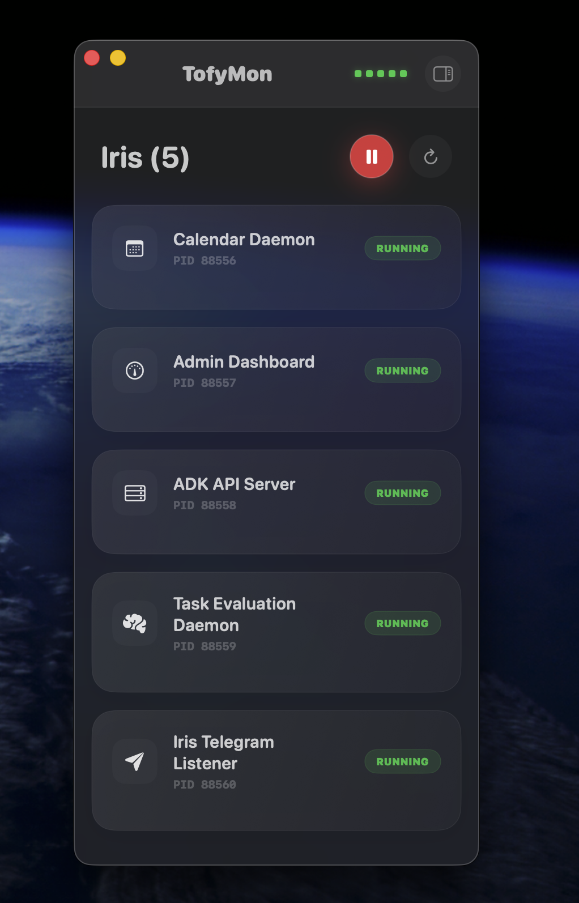

# TofyMon 🚀

A premium, native macOS service supervisor for managing local project process groups.

TofyMon consists of three parts:

1.  **TofyDaemon**: A Rust-powered supervisor that manages process lifecycles via Unix sockets.
2.  **TofyCLI**: A command-line tool to register projects and control services.
3.  **TofyUI**: A glassmorphism-inspired SwiftUI dashboard for real-time monitoring.

---



## 🚀 How to Run

Follow these steps in order to get the full TofyMon experience:

### 1. Build the Core Components

First, build the Rust daemon and CLI:

```bash
cargo build --workspace
```

### 2. Start the Supervisor (Daemon)

The daemon must be running in the background to manage services.

```bash
./target/debug/daemon
```

_Tip: Keep this terminal open or run it as a background service._

### 3. Register a Project

Use the CLI to tell TofyMon which services to monitor by pointing it to a `tofy.config.json` file:

```bash
./target/debug/tofy start -c path/to/your/tofy.config.json
```

### 4. Launch the Dashboard

Open the **`ui`** folder in **Xcode** and press **Cmd + R**.

- The dashboard will automatically connect to the running daemon.
- Toggle the **Sidebar** (top-right icon) to switch between projects.
- Monitor real-time health squares and individual service stats.

---

## 📄 Configuration Format

TofyMon projects are defined using a JSON configuration file (e.g., `tofy.config.json`). The daemon uses `camelCase` for all configuration fields.

```json
{
  "schema": "tofy.v1",
  "id": "my-project",
  "name": "My Project",
  "root": ".",
  "keepAwake": true,
  "services": [
    {
      "id": "web-server",
      "name": "Web Server",
      "command": ["npm", "run", "dev"],
      "log": "logs/web.log",
      "restart": {
        "policy": "always",
        "maxAttempts": 3,
        "delaySeconds": 5
      }
    },
    {
      "id": "worker",
      "name": "Background Worker",
      "shell": "python3 worker.py",
      "log": "logs/worker.log",
      "dependsOn": ["web-server"]
    }
  ]
}
```

### Project Fields

| Field           | Type    | Description                                                                  |
| :-------------- | :------ | :--------------------------------------------------------------------------- |
| **`schema`**    | String  | Must be `tofy.v1`.                                                           |
| **`id`**        | String  | Unique machine-readable ID for the project.                                  |
| **`name`**      | String  | Human-readable display name for the dashboard.                               |
| **`root`**      | String  | Project root directory (relative paths resolve from here).                   |
| **`keepAwake`** | Boolean | (Optional) If true, prevents macOS from sleeping while services are running. |
| **`services`**  | Array   | List of service definitions.                                                 |

### Service Fields

- **`id`**: Unique ID for the service.
- **`name`**: Display name.
- **`command`**: Command as an array of arguments (e.g. `["node", "app.js"]`).
- **`shell`**: (Optional) Command as a single shell string. Use this if you need shell features like pipes or redirects.
- **`cwd`**: (Optional) Working directory for the service.
- **`log`**: (Optional) Path to the combined stdout/stderr log file.
- **`dependsOn`**: (Optional) Array of service IDs that must start before this one.
- **`restart`**: (Optional) Configuration for automatic restarts.
  - `policy`: `always`, `onFailure`, or `never` (default: `always`).
  - `maxAttempts`: Maximum restart attempts (default: `3`).
  - `delaySeconds`: Seconds to wait between restarts (default: `5`).

---

## 🛠 Features

- **Process Group Management**: Automatically handles children processes and prevents zombies.
- **IPC over Unix Sockets**: High-performance, local-only communication.
- **Glassmorphism UI**: Beautiful, translucent macOS dashboard with SF Pro typography.
- **Real-time Health Grid**: Visual square-grid indicating status across all services at a glance.
- **Zero-Downtime Migration**: Drop-in replacement for legacy shell-based watchdogs.
